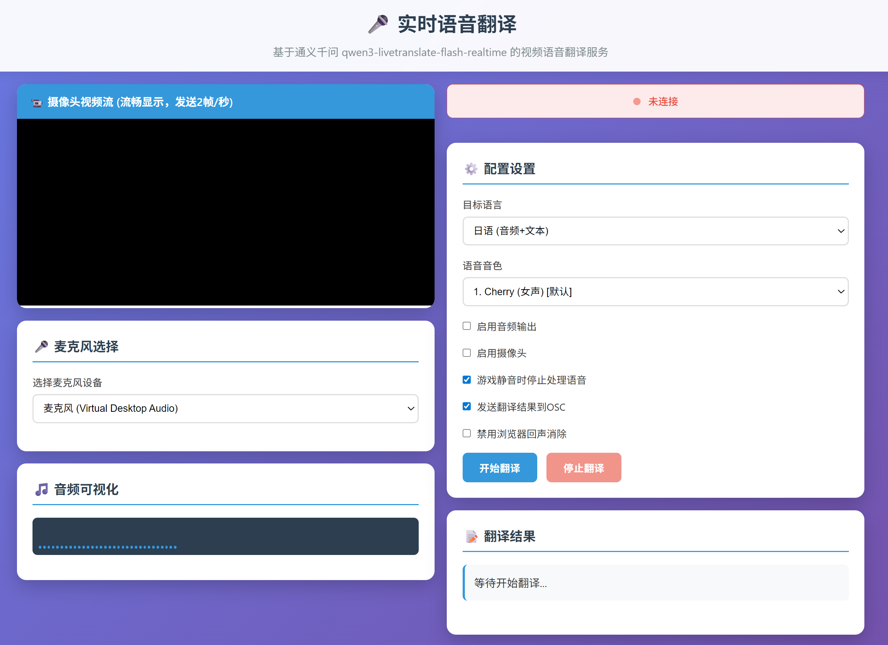

# 千问实时同传 VRChat 客户端

    

这个是基于阿里云给的demo改出来的，用于把千问实时同传的翻译结果，通过osc发送到VRChat中。

请确保VRChat已经开启了OSC接收功能。
请把设置`DASHSCOPE_API_KEY`为你的API Key。本程序同时也支持从`.env`文件中读取环境变量。

Release中有已经打包好的exe可以直接下载使用。（当然你得先准备好API Key）

我好懒，其他的懒得写了，GLHF