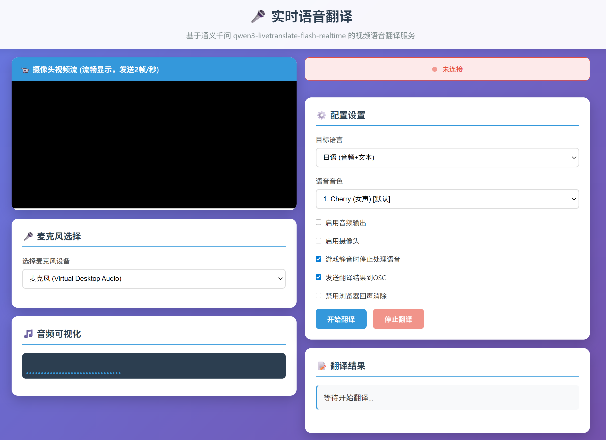

# 千问实时同传 Web 客户端

<div align="center">
    
</div>

这个是基于阿里云给的 demo 改出来的实时语音翻译 Web 客户端。

当前使用模型：`qwen3.5-livetranslate-flash-realtime`。它支持语音输入，目标语种覆盖 60 种，其中 29 种支持音频+文本输出，其余语种仅支持文本输出。

API Key 在前端页面中填写，并会保存到浏览器本地存储。启动服务后访问 `http://localhost:9023` 即可使用。

支持常开麦和按键麦两种输入模式。按键麦模式下按住说话、松开停止处理语音。

## Termux

在 Android 的 Termux 上可以这样运行：

```bash
pkg update
pkg install python ca-certificates openssl
python -m pip install -r requirements.txt
python start_server.py
```

然后在手机浏览器打开 `http://127.0.0.1:9023`。麦克风权限通常只会在 `localhost` / `127.0.0.1` 这类本机地址上正常放行；如果用局域网 IP 访问，移动浏览器可能会因为不是 HTTPS 而禁用麦克风。

Release 中有已经打包好的 exe 可以直接下载使用。（当然你得先准备好 API Key）

我好懒，其他的懒得写了，GLHF
